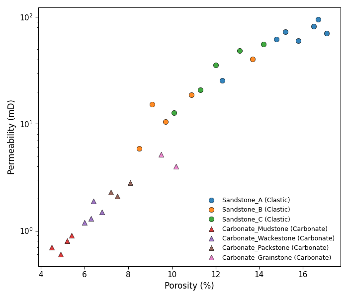
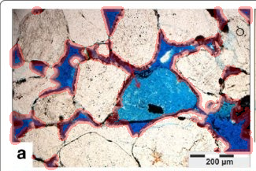

# 🧪 Mini Project – Reservoir Porosity & Thin-Section Image Analysis

This mini project is part of my **Year 4 Senior Project** in Reservoir Characterization.  
It demonstrates two small but practical Python workflows:

1. **Reservoir Porosity–Permeability Crossplot**  
2. **Blue-Dyed Thin Section Image–Based Porosity (OpenCV)**  

All figures, CSV datasets, and Python scripts used in this project are included in this repository.

---

## 📌 1. Reservoir Porosity–Permeability Crossplot

This part uses a synthetic clastic–carbonate dataset to visualise the relationship between  
**porosity (%)** and **permeability (mD)**, similar to standard reservoir quality evaluation.

### 🔍 Example Figure

The crossplot shows:
- Sandstone → higher porosity & permeability (better reservoir quality)  
- Carbonate mudstone/wackestone → lower permeability (seal/baffle behaviour)

### 📂 Files
- `mixed_clastic_carbonate_simple.csv` – dataset  
- `poro_perm_crossplot.py` – Python plotting script  
- `poro_perm_elsevier_style.png` – exported figure  

---

## 📌 2. Thin-Section Porosity from Blue-Dyed Images (OpenCV)

This workflow estimates **2D porosity** from thin-section images using the colour of  
**blue epoxy**, which fills pore space in impregnated thin sections.

### 🔍 Example Overlay Image

### 🛠 Workflow Summary
1. Read thin-section images: `SB1_SST_40x_01–04.jpg`  
2. Convert to **HSV colour space**  
3. Apply blue threshold to isolate pore pixels  
4. Count pore pixels / total pixels  
5. Save output to CSV + overlay images with pore boundaries  

### 📂 Files
- `pointcount.py` – OpenCV porosity extraction script  
- `porosity_results_SB1_SST.csv` – final porosity results  
- `SB1_SST_40x_01_overlay.png` – example processed image  

---

## 🌐 GitHub Pages (Project Webpage)

The mini project is also published as a webpage:

👉 **https://pruaksa-paengsri.github.io/miniproject/**

This page contains:
- Figures  
- Dataset download buttons  
- Workflow explanation  
- Future work notes  

---

## 🚀 Future Extensions
- Compare thin-section porosity vs core plug porosity  
- Process more samples (SB2, SB3, different facies)  
- Apply clustering / ML-based pore segmentation  
- Integrate into static modelling workflow  

---

## 👩‍💻 About

This project is part of my Year 4 senior project focusing on  
**reservoir quality, petrography, facies, and porosity interpretation**.  
It demonstrates how Python can support geological and petrophysical analysis.

---

